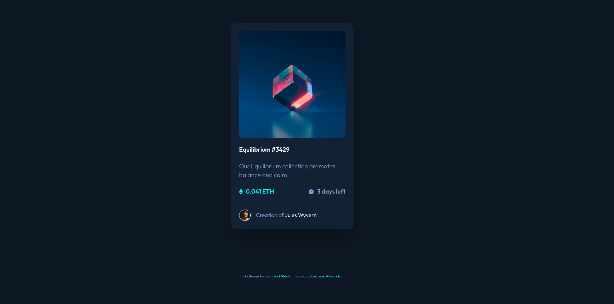

# Frontend Mentor - NFT preview card component solution

This is a solution to the [NFT preview card component challenge on Frontend Mentor](https://www.frontendmentor.io/challenges/nft-preview-card-component-SbdUL_w0U). Frontend Mentor challenges help you improve your coding skills by building realistic projects.

## Table of contents

- [Overview](#overview)
  - [The challenge](#the-challenge)
  - [Screenshot](#screenshot)
  - [Links](#links)
- [My process](#my-process)
  - [Built with](#built-with)
  - [What I learned](#what-i-learned)
  - [Continued development](#continued-development)
  - [Useful resources](#useful-resources)
- [Author](#author)

## Overview

### The challenge

Users should be able to:

- View the optimal layout depending on their device's screen size
- See hover states for interactive elements
- Experience smooth transitions on hover effects
- Navigate using keyboard (accessibility)

### Screenshot



### Links

- Solution URL: [GitHub Repository](https://github.com/galvaradosd/FM-NFT-Preview-Card-Component)
- Live Site URL: [Live Demo](https://galvaradosd.github.io/FM-NFT-Preview-Card-Component/)

## My process

### Built with

- **Semantic HTML5 markup** - Using `<main>`, `<article>`, `<footer>` for proper document structure
- **CSS Custom Properties** - For maintainable and scalable design tokens
- **CSS Logical Properties** - For better internationalization support
- **Flexbox** - For flexible one-dimensional layouts
- **CSS Grid** - For centering and layout positioning
- **Mobile-first workflow** - Starting from 320px and scaling up
- **BEM Methodology** - For organized and maintainable CSS class naming
- **Relative Units (rem/em)** - For better scalability and accessibility

### What I learned

This project was an excellent opportunity to implement modern CSS techniques and best practices:

#### 1. **CSS Logical Properties**

Instead of physical properties like `width`, `margin-left`, or `padding-top`, I used logical properties for better RTL support:

```css
.nft-card {
  inline-size: 100%; /* instead of width */
  padding-block: var(--spacing-300); /* instead of padding-top/bottom */
  padding-inline: var(--spacing-300); /* instead of padding-left/right */
  margin-block-end: var(--spacing-200); /* instead of margin-bottom */
}
```

#### 2. **BEM Methodology**

Organized CSS classes following Block Element Modifier pattern:

```html
<article class="nft-card">
  <div class="nft-card__image-container">
    
    <div class="nft-card__overlay">
      
    </div>
  </div>
  <div class="nft-card__content">
    <h1 class="nft-card__title">
      <a class="nft-card__title-link"></a>
    </h1>
  </div>
</article>
```

#### 3. **Fluid Typography with clamp()**

Responsive font sizes without media queries:

```css
:root {
  --font-size-body: clamp(1rem, 0.9rem + 0.5vw, 1.125rem);
  --font-size-heading: clamp(1.25rem, 1.1rem + 0.75vw, 1.375rem);
}
```

#### 4. **CSS Custom Properties for Design Tokens**

Organized variables by category for better maintainability:

```css
:root {
  /* Colors */
  --color-blue-500: hsl(215, 51%, 70%);
  --color-cyan-400: hsl(178, 100%, 50%);
  
  /* Spacing */
  --spacing-100: 0.5rem;
  --spacing-200: 1rem;
  
  /* Typography */
  --font-weight-light: 300;
  --font-weight-semibold: 600;
}
```

#### 5. **Accessibility Features**

- Semantic HTML structure
- Proper alt text for images
- `aria-hidden="true"` for decorative icons
- Focus-visible states for keyboard navigation
- Prefers-reduced-motion support

```css
@media (prefers-reduced-motion: reduce) {
  *,
  *::before,
  *::after {
    animation-duration: 0.01ms !important;
    transition-duration: 0.01ms !important;
  }
}
```

### Continued development

Areas I want to continue exploring and improving:

1. **CSS Container Query Units** - Exploring more use cases for `cqi`, `cqb`, `cqmin`, `cqmax`
2. **CSS Cascade Layers (@layer)** - For better CSS organization and specificity control
3. **CSS Nesting** - Native CSS nesting for cleaner code structure
4. **View Transitions API** - For smooth page transitions
5. **CSS Grid subgrid** - For more complex nested layouts
6. **Color Functions** - `color-mix()`, `oklch()` for better color manipulation

### Useful resources

- [CSS Logical Properties](https://developer.mozilla.org/en-US/docs/Web/CSS/CSS_Logical_Properties) - Understanding logical properties for internationalization
- [BEM Methodology](https://getbem.com/) - Official BEM naming convention guide
- [Modern CSS Reset](https://piccalil.li/blog/a-modern-css-reset/) - Andy Bell's modern CSS reset approach
- [Fluid Typography](https://www.smashingmagazine.com/2022/01/modern-fluid-typography-css-clamp/) - Guide to responsive typography with clamp()
- [Web.dev - Container Queries](https://web.dev/new-responsive/) - New responsive design with container queries

## Author

- Frontend Mentor - [@galvaradosd](https://www.frontendmentor.io/profile/galvaradosd)
- GitHub - [@galvaradosd](https://github.com/galvaradosd)


---

## Project Structure

```
FM NFT Preview Card Component/
├── assets/
│   └── images/
│       ├── favicon-32x32.png
│       ├── icon-clock.svg
│       ├── icon-ethereum.svg
│       ├── icon-view.svg
│       ├── image-avatar.png
│       └── image-equilibrium.jpg
├── index.html
├── style.css
└── README.md
```

## Design Specifications

- **Mobile**: 375px
- **Desktop**: 1440px
- **Font Family**: [Outfit](https://fonts.google.com/specimen/Outfit)
- **Font Weights**: 300 (Light), 400 (Regular), 600 (SemiBold)
- **Font Size**: 18px (body copy)

### Color Palette

**Primary**
- Blue 500: `hsl(215, 51%, 70%)`
- Cyan 400: `hsl(178, 100%, 50%)`

**Neutral**
- Blue 950 (Main BG): `hsl(217, 54%, 11%)`
- Blue 900 (Card BG): `hsl(216, 50%, 16%)`
- Blue 800 (Line): `hsl(215, 32%, 27%)`
- White: `hsl(0, 0%, 100%)`

---
